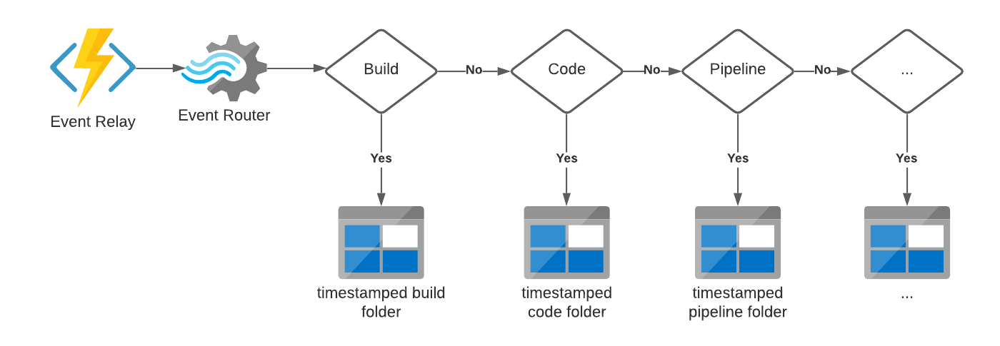

# Azure DevOps Subscription Generator
Subscription Generator is a command line tool for Azure DevOps which helps add subscriptions for the triggers that are enabled for Azure DevOps Service Hooks. The default subscription use is via an Azure Service Bus Queue.

In order to configure ADOSubscriptionGenerator you should compile and ensure that a file called config.json is in the same directory as the .exe file. Config.json contains the following details:

- A Personal Access Token (PAT) token which is organisational-wide and is created per user
- An endpoint to an Azure DevOps instance which is preceded by https://dev.azure.com/
- A connection string to a service bus
- The name of a service bus queue 

The json representation should looked like the following:

```
{
   "pat": "",
   "endpoint": "https://dev.azure.com/bp",
   "connectionString": "",
   "queueName": ""
}
```

An event router pattern can be put in place to ensure that all data is landed. There are many different implementations of this but one implementation 



In addition to the subscription generation sll service bus messages are received by a boiler plate Azure Function which can be deployed. The sample code containing the input and output bindings is in the repo. In order to deploy the function the following should be created in the local.settings.json file which contains the connection string (access policy) to the service and an event hub connection string. The input binding to the service bus produces a one-to-one message onto the event hub for the Azure DevOps triggered event.

```
{
    "IsEncrypted": false,
    "Values": {
      "AzureWebJobsStorage": "UseDevelopmentStorage=true",
      "FUNCTIONS_WORKER_RUNTIME": "dotnet",
      "sb_conn": "",
      "eh_conn": ""
   }
}
```

Once deployed two application settings should be created in the function app called *sb_conn* and *eh_conn*.